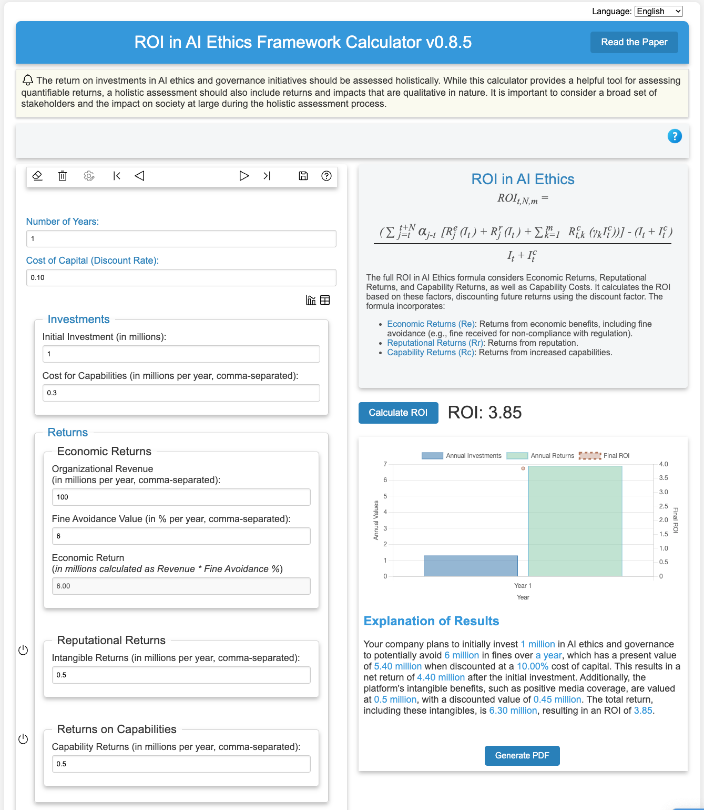

# HROE Calculator
The paper titled, "The Return on Investment in AI Ethics: A Holistic Framework" (https://arxiv.org/pdf/2309.13057)
proposes a comprehensive approach to understanding the returns on investments in AI ethics. It introduces the Holistic
Return on Ethics (HROE) framework, which considers not only direct economic returns but also intangible benefits related
to reputation and real options connected to organizational capabilities. This framework is designed to help
organizations justify their investments in AI ethics by demonstrating how these investments can lead to cost savings,
revenue generation, improved stakeholder perceptions, and enhanced future opportunities.

AI technologies, while beneficial, pose significant ethical challenges such as bias, fairness, and privacy concerns.
Addressing these issues requires substantial investments, which organizations often find difficult to justify without
clear evidence of return on investment. The HROE framework addresses this gap by integrating economic impacts, such as
direct financial returns and cost avoidance, with intangible impacts, like improved reputation and stakeholder trust.
Additionally, it includes real options that offer future flexibility and adaptability. This approach provides a
comprehensive view of how AI ethics investments can contribute to an organization's overall success and sustainability,
making it easier to justify and sustain these critical initiatives.

In line with this holistic approach, this program uses the formulas provided in the paper with a slight addition
to calculate the extended ROI of AI ethics investments over multiple years. This program, which you can try [here](https://ibm.github.io/hroecalc/), prompts users for inputs
related to economic returns, reputational returns, and capability returns for each year, as well as the discount factor
and initial investment costs. By incorporating these variables, the program computes the HROE by discounting future
returns to their present value and summing up the total returns from economic, reputational, and capability investments.
This multi-year approach allows organizations to better evaluate the long-term benefits of their AI ethics investments,
providing a clearer picture of how these investments impact their overall performance and strategic flexibility.

# Slated for Open-Source
We are excited to announce our plans to make this calculator open source in close collaboration with the University of Notre Dame's AI Ethics Lab. I had the privilege of presenting the calculator at the 2024 Responsible AI in Finance event held at the University of Notre Dame, where it was met with great enthusiasm.

# Early Reviews
"Great job, Jose! Keep up the good work!" 
--**James J. Kavanaugh, Senior Vice President and Chief Financial Officer at IBM, Board Member**

"Thanks Jose De Jesus... Keep up the great work on the AI ethics ROI calculator!" 
--**Francesca Rossi, IBM Fellow and AI Ethics Global Leader**

"The ROI calculator that Jose developed takes a theoretical framework and puts it into the hands of practitioners in a user friendly tool. The calculator was demoed live during the AI in Finance event held at Notre Dame University in November 2024. The feedback from the audience of Chief Financial Officers and other executives was overwhelmingly positive. The calculator will a critical tool in the tool of business leaders that are working to implement AI ethics and governance practices, which makes its development both a contribution to the organizations that use it and to society as a whole.... The calculator will be of great interest to me and many other leaders in AI Governance." 
-- **Heather Domin, PhD, Global Leader, Responsible AI Initiatives, IBM Office of Privacy and Responsible Technology**

"In publishing our ROI paper, the goal was to eventually produce some sort of tool that would help organizations determine their ultimate return on investments in AI ethics. Thanks to Jose we now have such a tool. Without being asked to do so and only after reading the paper, Jose proactively took the initiative to draft a calculator and bring it to the team's attention. He continuously asked for input and ways to improve it. Due to all of his hard work, it was extremely well received by academics and practitioners alike, and will greatly contribute to not only our existing research but also to the work that organizations are conducting in the field of AI ethics." 
-- **Marialena Bevilacqua, PhD Student in Analytics, Mendoza College of Business, University of Notre Dame**

# Instructions to Run the Program Locally
To run the program locally, simply clone the repository onto any folder of your computer and open the HROE.html file from your browser. You can right-click the file and select Open With… Chrome, for example, or open the HROE.html file from within your browser (e.g., File > Open…).

# Python (Command-line) Version of the Program
There is also an older, command-line version of the program written in Python. Follow these instructions to run it.

**1. Install Python** 
Ensure you have Python installed on your system. You can download it from the official Python website.

**2. Install Required Libraries** 
Open a terminal or command prompt and run the following commands to install the required libraries:

`pip install colorama`

**3. Run the program** 

`python hroe.py`

